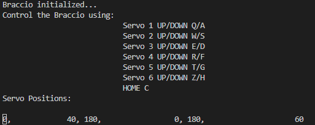

# braccio-control-python
Code snippet to control the Tinkerkit Braccio robot arm.
Control the Braccio with Python keyboard inputs. 
Each input moves the robot's joints by small degree.

Ideal for learning/teaching purposes.

## Instructions
### 1. Arduino Code
Load the Arduino code found in `/arduino_code` onto your Arduino device.
Remember the communication port.

### 2. Start Python
Specify the communication port in `main.py`. 
Modify when line `braccioDebug :BraccioDebug = BraccioDebug(serial_port_robot_magnet="COM3")`
when the port differs.

### 3. Control Braccio
Control it using the keys displayed in the console.

